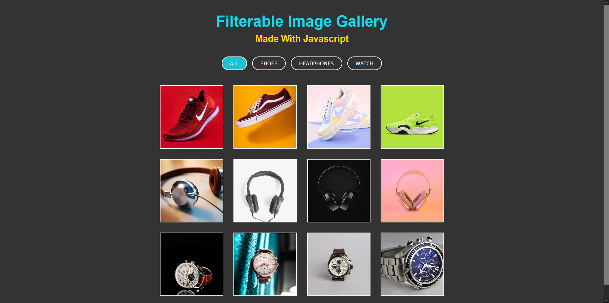

<h1 align="center">Filterable Image Gallery</h1>

 [LIVE](https://datkiddude.github.io/Filterable-Image-Gallery/)

## Built with

- Semantic HTML5 markup
- Google Fonts
- Mock JSON data
- Javascript
- Mobile-first workflow

Users should be able to:

1. Filter Images by category
2. Click an image and have a pop-up window of the image
3. View the optimal layout depending on their device's screen size.
